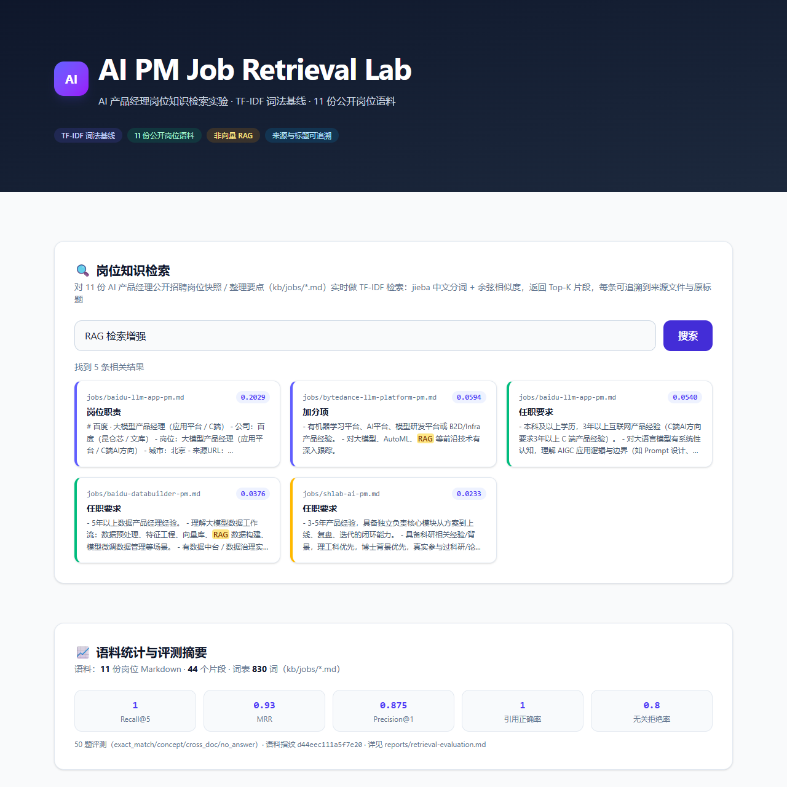

# AI PM Job Retrieval Lab · AI 产品经理岗位知识检索实验

一个**单一主旨、可复现**的岗位知识检索实验：以 11 份 AI 产品经理**公开招聘岗位快照 / 整理要点**为语料，实现 **TF-IDF 词法检索基线**（jieba 中文分词 + 余弦相似度 + Top-K），并用 **50 题可复现评测集**给出可核查的检索质量指标。当前是**检索与评测基线**，不是向量 RAG。



**30 秒运行**（本地 Demo，无需部署）：

```bash
npm ci && npm test && npm run demo
# 浏览器打开 http://localhost:3000
```

## 为什么做

转行 AI 产品经理岗位时，面临两个实际问题：

1. **岗位信息分散**：11 份公开 JD 散落在各招聘渠道，无法按「RAG / Agent / SQL / 评测」等能力维度快速检索对比。
2. **检索质量不可信**：多数演示只给「看起来相关」的结果，没有可复现的指标。本实验把检索做成**可运行、可测试、可评测**的工程：任何查询结果都能追溯到来源文件与原标题。

## 当前实现

| 模块 | 说明 |
| --- | --- |
| 语料 | 11 份公开 AI 产品经理岗位 Markdown（`kb/jobs/*.md`），含公司 / 岗位 / 城市 / 来源 URL / 抓取日期 |
| 切块 | 按 `##` 标题切块，前言（frontmatter）并入第一个小节 |
| 分词 | `@node-rs/jieba` 中文分词 + 领域用户词典（产品经理 / 大模型 / 需求分析 等） |
| 检索 | TF-IDF 稀疏向量 + 余弦相似度，Top-K；大小写不敏感，分数有限不产生 NaN |
| 结果 | 来源文件 + 原标题 + 命中片段 + 相关度分数，全部可追溯 |
| 测试 | 15 条行为测试（`kb/test/search.test.mjs`），含语料边界、空语料、全 OOV、topK 边界 |
| 评测 | 50 题评测集（`kb/eval/questions.json`），五指标输出到 `kb/eval/results/` |

## 环境要求

- Node.js 20+
- npm（随 Node.js 安装）

## 快速开始

```bash
npm ci               # 按 package-lock.json 锁定安装，保证依赖可复现（唯一运行时依赖 @node-rs/jieba）
npm test             # 15 条行为测试
npm run eval         # 重跑评测，写 current.json（基线快照保护：覆盖 baseline 需 --force）
npm run demo         # 启动展示页 http://localhost:3000
node kb/search.mjs "RAG 检索增强" --top 5   # CLI 检索
```

## 界面预览

本地展示页适配桌面与手机宽度；手机视口无横向溢出：


以上均为本地 `npm run demo` 截图，仓库不提供在线 Demo。

## 示例查询

```bash
node kb/search.mjs "京东 算法产品经理" --top 3
# [jobs/jd-algo-pm.md | 岗位职责]
# - 负责智能算法类产品的需求挖掘、算法预研、产品规划设计与迭代...

node kb/search.mjs "Agentic AI Product Manager" --top 2
# [jobs/apple-agentic-ai-pm.md | 原始来源]
# [jobs/apple-agentic-ai-pm.md | 岗位职责]
# （按实际相关度顺序返回；分数随语料/评测版本变动，以 CLI 输出为准）

node kb/search.mjs "哪些岗位要求 SQL" --top 5
# baidu-llm-app-pm / apple-ai-pm-ops / jd-algo-pm 等（SQL 相关岗位）

node kb/search.mjs "天气预报"
# 未找到相关内容（无关查询被正确拒绝）
```

## 评测

评测集 50 题，四类（`kb/eval/questions.json`）：

| 类别 | 数量 | 说明 |
| --- | --- | --- |
| exact_match | 15 | 精确锚点题（公司 + 岗位 / 工具 + 要求） |
| concept | 15 | 概念题（Agent / RAG / Prompt / 数据驱动 等） |
| cross_doc | 10 | 跨文档题（哪些岗位要求 SQL / Python / 大模型平台） |
| no_answer | 10 | 无关题（天气预报 / 加密货币行情 等，含 2 条近失配） |

当前基线（语料指纹 `d44eec111a5f7e20`，11 份语料 / 44 chunk）：

| 指标 | 值 |
| --- | --- |
| Recall@5 | 1.000（40/40） |
| MRR | 0.930 |
| Precision@1 | 0.875（35/40） |
| 引用正确率 | 1.000（40/40） |
| 无关拒绝率 | 0.800（8/10） |

结果 JSON 在 `kb/eval/results/baseline-tfidf.json`（基线）与 `current.json`（最新一次）。失败题与判定口径见 [reports/retrieval-evaluation.md](reports/retrieval-evaluation.md)。

## 项目结构

```
.
├── package.json              # 根包：test / eval / search / capability / demo / verify
├── kb/
│   ├── jobs/                 # 11 份岗位语料（唯一检索语料，含来源 URL）
│   ├── lib/                  # indexer（切块 + TF-IDF）+ retriever（余弦 Top-K）
│   ├── eval/                 # 评测集 + 评测脚本 + results/
│   ├── test/                 # 15 条行为测试
│   └── search.mjs            # CLI 检索入口
├── scripts/
│   └── generate-capability-report.js   # 能力分析派生报告生成器
├── reports/
│   ├── capability-analysis.md          # 能力分析报告（派生分析）
│   └── retrieval-evaluation.md         # 检索评测报告
└── showcase/                 # 展示页（纯原生 JS + Tailwind v4 本地编译 CSS，无前端框架）
```

## 能力分析

`reports/capability-analysis.md` 是检索实验的**派生分析**：对同一份 11 份岗位语料做抽取式统计（关键词匹配，非 LLM 生成），回答「这些岗位最看重哪些能力」。每个数字可回溯到 manifest（`reports/capability-analysis.manifest.json`）与 JD 原文。重新生成：

```bash
npm run capability
```

## 技术边界

- **词法基线，非语义检索**：TF-IDF 只能做字面 token 匹配。同义改写、语义近似（如「提示词」与「Prompt」的不同写法）不在当前能力范围，评测里的 2 条近失配题（`na09/na10`）正是这一边界。
- **语料固定**：检索只索引 `kb/jobs/*.md`（11 份）。`README.md`、隐藏文件、`node_modules`、评测/报告均不入语料（由测试 T8/T9 断言）。
- **样板块过滤仅用于评测**：评测对「原始来源 / 收录原则」等元数据块做过滤后再算指标；CLI 与展示页返回的是原始 Top-K，可能包含来源块。
- **换行可复现**：切块入口统一把 CRLF/CR 归一为 LF，根目录 `.gitattributes` 固定文本为 LF；同一 commit 在 Windows（`core.autocrlf=true` 空克隆）与 Linux 上 chunk、测试与五项指标一致（T16/T17 回归）。

## Roadmap

- [ ] 文档向量化（embedding + 本地向量库）建立语义召回基线
- [ ] 混合检索（BM25 + 向量 + RRF 融合）
- [ ] 用同一份 50 题评测集对比各方案，新增语义/近义改写题
- [ ] 语料扩增（更多岗位与方向），并同步更新指纹、基线、评测

## License

本仓库作者原创的代码与文档采用 [MIT](LICENSE)。`kb/jobs/` 中的岗位信息是基于公开招聘来源整理的最小必要摘录，仅用于研究、教学与求职分析；原始岗位文本及相关商标等权利归各自权利人所有，**不包含在 MIT 授权范围内**。每份语料保留来源 URL 与整理日期，如权利人要求移除请联系维护者。
